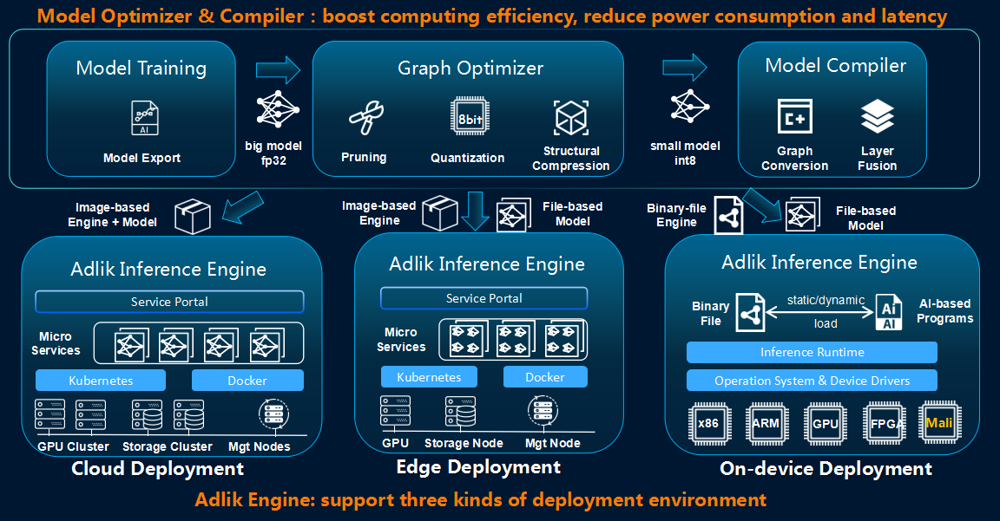
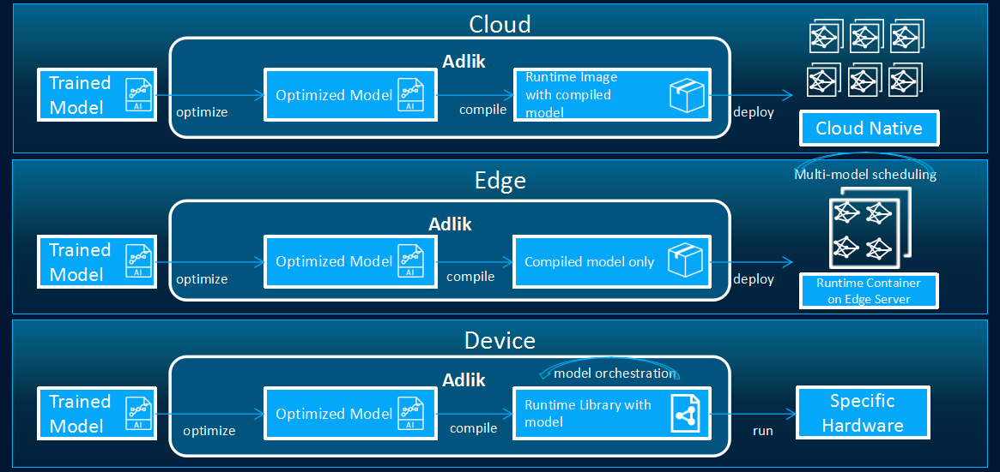

# Adlik

[](https://dev.azure.com/Adlik/GitHub/_build/latest?definitionId=1&branchName=master)
[](https://dev.azure.com/Adlik/GitHub/_build/latest?definitionId=1&branchName=master)
[](https://dev.azure.com/Adlik/GitHub/_build/latest?definitionId=1&branchName=master)
[](https://app.bors.tech/repositories/20625)

***Adlik*** [ædlik] is an end-to-end optimizing framework for deep learning models. The goal of Adlik is to accelerate deep
learning inference process both on cloud and embedded environment.



With Adlik framework, different deep learning models can be deployed to different platforms with high performance in a
much flexible and easy way.



1. In cloud environment, the compiled model and Adlik Inference Engine should be built as a docker image, and deployed
as a container.

2. In edge environment, Adlik Inference Engine should be deployed as a container. The compiled model should be transferred
to edge environment, and the Adlik Inference Engine should automatically update and load model.

3. In device environment, Adlik Inference Engine and the compiled model should be compiled into a binary file (***so***
or ***lib***). Users who want to run model inference on device should link user defined AI function and Adlik binary
file to the execution file, and run directly.

## [Inference performance of Adlik](https://github.com/Adlik/Adlik/tree/add-incpetionV3-test-result/benchmark#inference-performance-of-adlik)

We provide an automatic [benchmark tool](https://github.com/Adlik/Adlik/tree/master/benchmark) to test the inference performance of DL models with Adlik on the same CPU or GPU. Using the benchmark tool, we got the test performance data of the simple CNN model (MNIST model),
the ResNet50 model, and InceptionV3 with different serving engines. The test performance data of Adlik


## Contents

### [Model Optimizer](https://github.com/Adlik/model_optimizer/blob/master/README.md)

***Model optimizer*** focuses on specific hardware and runs on it to achieve acceleration.  The proposed
framework mainly consists of two categories of algorithm components, i.e. pruner and quantizer.

### [Model compiler](model_compiler/README.md)

***Model compiler*** supports several optimizing technologies like pruning, quantization and structural compression,
which can be easily used for models developed with TensorFlow, Keras, PyTorch, etc.

### [Serving Engine](adlik_serving/README.md)

***Serving Engine*** provides deep learning models with optimized runtime based on the deployment environment. Put
simply, based on a deep learning model, the users of Adlik can optimize it with model compiler and then deploy it to a
certain platform with Adlik serving platform.

## Build

This guide is for building Adlik on [Ubuntu](https://ubuntu.com) systems.

First, install [Git](https://git-scm.com/download) and [Bazel](https://docs.bazel.build/install.html).

Then, clone Adlik and change the working directory into the source directory:

```sh
git clone https://github.com/ZTE/Adlik.git
cd Adlik
```

### Build clients

1. Install the following packages:
   - `python3-setuptools`
   - `python3-wheel`
2. Build clients:

   ```sh
   bazel build //adlik_serving/clients/python:build_pip_package -c opt
   ```

3. Build pip package:

   ```sh
   mkdir /tmp/pip-packages && bazel-bin/adlik_serving/clients/python/build_pip_package /tmp/pip-packages
   ```

### Build serving

First, install the following packages:

- `automake`
- `libtbb2`
- `libtool`
- `make`
- `python3-six`

#### Build serving with OpenVINO runtime

1. Install `intel-openvino-runtime-ubuntu<OS_VERSION>-<VERSION>` package from
   [OpenVINO](https://docs.openvinotoolkit.org/2020.3/_docs_install_guides_installing_openvino_apt.html).
2. Assume the installation path of OpenVINO is `/opt/intel/openvino_VERSION`, run the following command:

   ```sh
   export INTEL_CVSDK_DIR=/opt/intel/openvino_VERSION
   export InferenceEngine_DIR=$INTEL_CVSDK_DIR/deployment_tools/inference_engine/share
   bazel build //adlik_serving \
       --config=openvino \
       -c opt
   ```

#### Build serving with TensorFlow CPU runtime

Run the following command:

```sh
bazel build //adlik_serving \
    --config=tensorflow-cpu \
    -c opt
```

#### Build serving with TensorFlow GPU runtime

Assume builing with CUDA version 11.0.

1. Install the following packages from
   [here](https://docs.nvidia.com/cuda/cuda-installation-guide-linux/index.html#ubuntu-installation) and
   [here](https://docs.nvidia.com/deeplearning/sdk/cudnn-install/index.html#ubuntu-network-installation):

   - `cuda-cupti-dev-11-0`
   - `libcublas-dev-11-0`
   - `libcudnn8=*+cuda11.0`
   - `libcudnn8-dev=*+cuda11.0`
   - `libcufft-dev-11-0`
   - `libcurand-dev-11-0`
   - `libcusolver-dev-11-0`
   - `libcusparse-dev-11-0`
2. Run the following command:

   ```sh
   env TF_CUDA_VERSION=11.0 \
       bazel build //adlik_serving \
           --config=tensorflow-gpu \
           -c opt \
           --incompatible_use_specific_tool_files=false
   ```

#### Build serving with TensorFlow Lite CPU runtime

Run the following command:

```sh
bazel build //adlik_serving \
    --config=tensorflow-lite-cpu \
    -c opt
```

#### Build serving with TensorRT runtime

Assume building with CUDA version 11.0.

1. Install the following packages from
   [here](https://docs.nvidia.com/cuda/cuda-installation-guide-linux/index.html#ubuntu-installation) and
   [here](https://docs.nvidia.com/deeplearning/sdk/cudnn-install/index.html#ubuntu-network-installation):

   - `cuda-cupti-dev-11-0`
   - `cuda-nvml-dev-11-0`
   - `cuda-nvrtc-11-0`
   - `libcublas-dev-11-0`
   - `libcudnn8=*+cuda11.0`
   - `libcudnn8-dev=*+cuda11.0`
   - `libcufft-dev-11-0`
   - `libcurand-dev-11-0`
   - `libcusolver-dev-11-0`
   - `libcusparse-dev-11-0`
   - `libnvinfer7=7.1.*+cuda11.0`
   - `libnvinfer-dev=7.1.*+cuda11.0`
   - `libnvonnxparsers7=7.1.*+cuda11.0`
   - `libnvonnxparsers-dev=7.1.*+cuda11.0`
2. Run the following command:

   ```sh
   env TF_CUDA_VERSION=11.0 \
       bazel build //adlik_serving \
           --config=tensorrt \
           -c opt \
           --action_env=LIBRARY_PATH=/usr/local/cuda-11.0/lib64/stubs \
           --incompatible_use_specific_tool_files=false
   ```

### Build in Docker

The `ci/docker/build.sh` file can be used to build a Docker images that contains all the requirements for building
Adlik. You can build Adlik with the Docker image.

>Note: If you build the runtime with GPU in a Docker image, you need to add the CUDA environment variables in the
>Dockerfile, such as:
>
>```dockerfile
>ENV NVIDIA_VISIBLE_DEVICES all
>ENV NVIDIA_DRIVER_CAPABILITIES compute, utility
>```

## Getting Started

- [Tutorials](TUTORIALS.md)

- [Samples](examples)

### Release

The version of the service engine Adlik supports.

|            | TensorFlow 1.14 | TensorFlow 2.1 | Tensorflow 2.2 | OpenVINO 2020 | Tensorrt 6 | Tensorrt 7 |
| ---------- | :-------------: | :------------: | :------------: | :-----------: | :--------: | :--------: |
| Keras      |        ✓        |       ✓        |        ✓       |       ✓       |     ✓      |     ✓      |
| TensorFlow |        ✓        |       ✓        |        ✓       |       ✓       |     ✓      |     ✓      |
| PyTorch    |        ✗        |       ✗        |        ✗       |       ✓       |     ✓      |     ✗      |

## License

Apache License 2.0
