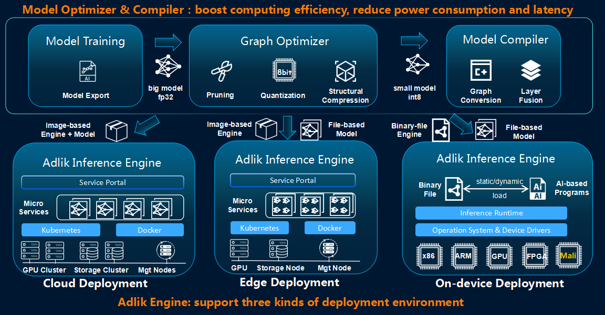
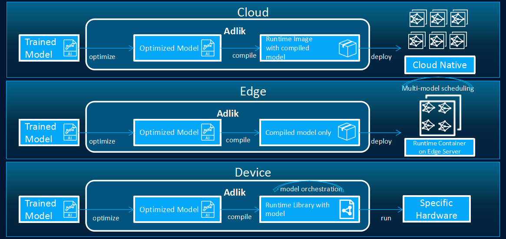

# Adlik

[](https://dev.azure.com/Adlik/GitHub/_build/latest?definitionId=1&branchName=master)
[](https://dev.azure.com/Adlik/GitHub/_build/latest?definitionId=1&branchName=master)
[](https://dev.azure.com/Adlik/GitHub/_build/latest?definitionId=1&branchName=master)
[](https://app.bors.tech/repositories/20625)
[](https://bestpractices.coreinfrastructure.org/projects/4513)

***Adlik*** [ædlik] is an end-to-end optimizing framework for deep learning models. The goal of Adlik is to accelerate deep
learning inference process both on cloud and embedded environment.



With Adlik framework, different deep learning models can be deployed to different platforms with high performance in a
much flexible and easy way.



1. In cloud environment, the compiled model and Adlik Inference Engine should be built as a docker image, and deployed
as a container.

2. In edge environment, Adlik Inference Engine should be deployed as a container. The compiled model should be transferred
to edge environment, and the Adlik Inference Engine should automatically update and load model.

3. In device environment, Adlik Inference Engine and the compiled model should be compiled into a binary file (***so***
or ***lib***). Users who want to run model inference on device should link user defined AI function and Adlik binary
file to the execution file, and run directly.

## [Inference performance of Adlik](https://github.com/Adlik/Adlik/tree/master/benchmark#inference-performance-of-adlik)

We test the inference performance of Adlik on the same CPU or GPU using the simple CNN model (MNIST model),
the ResNet50 model, and InceptionV3 with different serving engines. The test performance data of Adlik
on different models are as follows:

- [The test result of the MNIST model](https://github.com/Adlik/Adlik/tree/master/benchmark#the-test-result-of-the-mnist-model)
- [The test result of the ResNet50 model](https://github.com/Adlik/Adlik/tree/master/benchmark#the-test-result-of-the-resnet50-model)
- [The test result of the InceptionV3 model](https://github.com/Adlik/Adlik/tree/master/benchmark#the-test-result-of-the-inceptionv3-model)
- [The test result of the YoloV3 model](https://github.com/Adlik/Adlik/tree/master/benchmark#the-test-result-of-the-YoloV3-model)
- [The test result of the Bert model](https://github.com/Adlik/Adlik/tree/master/benchmark#the-test-result-of-the-Bert-model)
- [The test result of PaddlePaddle model](benchmark/PADDLE_RESULT.md)

## Contents

### [Model Optimizer](https://github.com/Adlik/model_optimizer/blob/master/README.md)

***Model optimizer*** focuses on specific hardware and runs on it to achieve acceleration.  The proposed
framework mainly consists of two categories of algorithm components, i.e. pruner and quantizer.

### [Model Compiler](model_compiler/README.md)

***Model compiler*** supports several optimizing technologies like pruning, quantization and structural compression,
which can be easily used for models developed with TensorFlow, Keras, PyTorch, etc.

### [Serving Engine](adlik_serving/README.md)

***Serving Engine*** provides deep learning models with optimized runtime based on the deployment environment. Put
simply, based on a deep learning model, the users of Adlik can optimize it with model compiler and then deploy it to a
certain platform with Adlik serving platform.

## Getting Started

- [Tutorials](TUTORIALS.md)

- [Samples](examples)

## Docker images

All Adlik compiler images and serving images are stored in [Alibaba Cloud](https://free.aliyun.com/). These images can
be downloaded and used directly, users do not need to build the Adlik on [Ubuntu](https://ubuntu.com). Users can use
the compiler images to compile model from H5, CheckPoint, FrozenGraph, ONNX and SavedModel to Openvino, TensorFlow,
TensorFlow Lite, TensorRT. Users also can use the serving images for model inference.

Docker pull command:

   ```shell script
   docker pull docker_image_name:tag
   ```

### Compiler docker images

The compiler docker images can be used in CPU and GPU. In the CPU, you can  compile the model from source type to TensorFlow
model, OpenVino model and TensorFlow Lite model. And in the CPU, you can compile the model from source type to TensorFlow
model, and TensorRT model. The name and label of compiler mirror are shown below, and the first half of label
represents the version of TensorRT, the latter part of label represents the version of CUDA:

registry.cn-beijing.aliyuncs.com/adlik/model-compiler:v0.5.0_trt7.2.1.6_cuda11.0

#### Using model compiler image compile model

1. Run the image.

   ```shell script
   docker run -it --rm -v source_model:/mnt/model
   registry.cn-beijing.aliyuncs.com/adlik/model-compiler:v0.5.0_trt7.2.1.6_cuda11.0 bash
   ```

2. Configure the json file or environment variables required to compile the model.

   The [config_schema.json](model_compiler/config_schema.json) describle the json file field information,
   and for the example, you can reference [compiler_json_example.json](docker-images/compiler_json_example.json).
   For the environment variable field description, see [env_field.txt](docker-images/env_field.txt), for the example,
   reference [compiler_env_example.txt](docker-images/compiler_env_example.txt).

   Note: The checkpoint model must be given the input and output op names of the model when compiling, and other models
   can be compiled without the input and output op names of the model.

3. Compile the model.

   Compilation instructions (json file mode):

   ```shell script
   python3 "-c" "import json; import model_compiler as compiler; file=open('/mnt/model/serving_model.json','r');
   request = json.load(file);compiler.compile_model(request); file.close()"
   ```

   Compilation instructions (environment variable mode):

   ```shell script
   python3 "-c" "import model_compiler.compiler as compiler;compiler.compile_from_env()"
   ```

### Serving docker images

The serving docker images contains CPU and GPU mirrors. The label of openvino image represents the version of OpenVINO.
And for the TensorRT image the first half of label represents the version of TensorRT, the latter part of label
represents the version of CUDA. The names and labels of serving mirrors are as follows:

CPU:

registry.cn-beijing.aliyuncs.com/adlik/serving-tflite-cpu:v0.5.0

registry.cn-beijing.aliyuncs.com/adlik/serving-tensorflow-cpu:v0.5.0

registry.cn-beijing.aliyuncs.com/adlik/serving-openvino:v0.5.0

registry.cn-beijing.aliyuncs.com/adlik/serving-libtorch-cpu:v0.5.0

GPU:

registry.cn-beijing.aliyuncs.com/adlik/serving-tftrt-gpu:v0.5.0

registry.cn-beijing.aliyuncs.com/adlik/serving-tensorrt:v0.5.0_trt7.2.1.6_cuda11.0

registry.cn-beijing.aliyuncs.com/adlik/serving-libtorch-gpu:v0.5.0

### Using the serving images for model inference

1. Run the mirror and pay attention to mapping out the service port.

   ```shell script
   docker run -it --rm -p 8500:8500 -v compiled_model:/model
   registry.cn-beijing.aliyuncs.com/adlik/serving-openvino:v0.5.0 bash
   ```

2. Load the compiled model in the image and start the service.

   ```shell script
   adlik-serving --grpc_port=8500 --http_port=8501 --model_base_path=/model
   ```

3. Install the client wheel package [adlik serving package](
   <https://github.com/Adlik/Adlik/releases/download/v0.3.0/adlik_serving_api-0.3.0-py2.py3-none-any.whl>) or [adlik
   serving gpu package](
      <https://github.com/Adlik/Adlik/releases/download/v0.3.0/adlik_serving_api_gpu-0.3.0-py2.py3-none-any.whl>) locally,
      execute the inference code, and perform inference.

Note: If the service port is not mapped when you run the mirror, you need install the [adlik serving package](
   <https://github.com/Adlik/Adlik/releases/download/v0.3.0/adlik_serving_api-0.3.0-py2.py3-none-any.whl>) or [adlik
   serving gpu package](
      <https://github.com/Adlik/Adlik/releases/download/v0.3.0/adlik_serving_api_gpu-0.3.0-py2.py3-none-any.whl>) in the
      container. Then execute the inference code, and perform inference in the container.

## Build

This guide is for building Adlik on [Ubuntu](https://ubuntu.com) systems.

First, install [Git](https://git-scm.com/download) and [Bazel](https://docs.bazel.build/install.html).

Then, clone Adlik and change the working directory into the source directory:

   ```sh
   git clone https://github.com/Adlik/Adlik.git
   cd Adlik
   ```

### Build clients

1. Install the following packages:
   - `python3-setuptools`
   - `python3-wheel`
2. Build clients:

   ```sh
   bazel build //adlik_serving/clients/python:build_pip_package -c opt
   ```

3. Build pip package:

   ```sh
   mkdir /tmp/pip-packages && bazel-bin/adlik_serving/clients/python/build_pip_package /tmp/pip-packages
   ```

### Build serving

First, install the following packages:

- `automake`
- `libtbb2`
- `libtool`
- `make`
- `python3-six`

#### Build serving with OpenVINO runtime

1. Install `openvino-<VERSION>` package from
   [OpenVINO](https://docs.openvinotoolkit.org/2022.1/openvino_docs_install_guides_installing_openvino_apt.html).
2. Assume the installation path of OpenVINO is `/opt/intel/openvino_VERSION`, run the following command:

   ```sh
   export INTEL_CVSDK_DIR=/opt/intel/openvino_2022
   export InferenceEngine_DIR=$INTEL_CVSDK_DIR/runtime/cmake
   bazel build //adlik_serving \
       --config=openvino \
       -c opt
   ```

#### Build serving with TensorFlow CPU runtime

1. Run the following command:

   ```sh
   bazel build //adlik_serving \
       --config=tensorflow-cpu \
       -c opt
   ```

#### Build serving with TensorFlow GPU runtime

Assume building with CUDA version 11.0.

1. Install the following packages from
   [here](https://docs.nvidia.com/cuda/cuda-installation-guide-linux/index.html#ubuntu-installation) and
   [here](https://docs.nvidia.com/deeplearning/sdk/cudnn-install/index.html#ubuntu-network-installation):

   - `cuda-nvprune-11-0`
   - `cuda-nvtx-11-0`
   - `cuda-cupti-dev-11-0`
   - `libcublas-dev-11-0`
   - `libcudnn8=*+cuda11.0`
   - `libcudnn8-dev=*+cuda11.0`
   - `libcufft-dev-11-0`
   - `libcurand-dev-11-0`
   - `libcusolver-dev-11-0`
   - `libcusparse-dev-11-0`
   - `libnvinfer7=7.2.*+cuda11.0`
   - `libnvinfer-dev=7.2.*+cuda11.0`
   - `libnvinfer-plugin7=7.2.*+cuda11.0`
   - `libnvinfer-plugin-dev=7.2.*+cuda11.0`

2. Run the following command:

   ```sh
   env TF_CUDA_VERSION=11.0 TF_NEED_TENSORRT=1 \
       bazel build //adlik_serving \
           --config=tensorflow-gpu \
           -c opt \
           --incompatible_use_specific_tool_files=false
   ```

#### Build serving with TensorFlow Lite CPU runtime

1. Run the following command:

   ```sh
   bazel build //adlik_serving \
       --config=tensorflow-lite-cpu \
       -c opt
   ```

#### Build serving with TensorRT runtime

Assume building with CUDA version 11.0.

1. Install the following packages from
   [here](https://docs.nvidia.com/cuda/cuda-installation-guide-linux/index.html#ubuntu-installation) and
   [here](https://docs.nvidia.com/deeplearning/sdk/cudnn-install/index.html#ubuntu-network-installation):

   - `cuda-cupti-dev-11-0`
   - `cuda-nvml-dev-11-0`
   - `cuda-nvrtc-11-0`
   - `libcublas-dev-11-0`
   - `libcudnn8=*+cuda11.0`
   - `libcudnn8-dev=*+cuda11.0`
   - `libcufft-dev-11-0`
   - `libcurand-dev-11-0`
   - `libcusolver-dev-11-0`
   - `libcusparse-dev-11-0`
   - `libnvinfer7=7.2.*+cuda11.0`
   - `libnvinfer-dev=7.2.*+cuda11.0`
   - `libnvonnxparsers7=7.2.*+cuda11.0`
   - `libnvonnxparsers-dev=7.2.*+cuda11.0`
2. Run the following command:

   ```sh
   env TF_CUDA_VERSION=11.0 \
       bazel build //adlik_serving \
           --config=TensorRT \
           -c opt \
           --action_env=LIBRARY_PATH=/usr/local/cuda-11.0/lib64/stubs \
           --incompatible_use_specific_tool_files=false
   ```

#### Build serving with TF-TRT runtime

Assume building with CUDA version 11.0.

1. Install the following packages from
   [here](https://docs.nvidia.com/cuda/cuda-installation-guide-linux/index.html#ubuntu-installation) and
   [here](https://docs.nvidia.com/deeplearning/sdk/cudnn-install/index.html#ubuntu-network-installation):

   - `cuda-cupti-dev-11-0`
   - `libcublas-dev-11-0`
   - `libcudnn8=*+cuda11.0`
   - `libcudnn8-dev=*+cuda11.0`
   - `libcufft-dev-11-0`
   - `libcurand-dev-11-0`
   - `libcusolver-dev-11-0`
   - `libcusparse-dev-11-0`
   - `libnvinfer7=7.2.*+cuda11.0`
   - `libnvinfer-dev=7.2.*+cuda11.0`
   - `libnvinfer-plugin7=7.2.*+cuda11.0`
   - `libnvinfer-plugin-dev=7.2.*+cuda11.0`

2. Run the following command:

   ```sh
   env TF_CUDA_VERSION=11.0 TF_NEED_TENSORRT=1 \
       bazel build //adlik_serving \
           --config=tensorflow-tensorrt \
           -c opt \
           --incompatible_use_specific_tool_files=false
   ```

#### Build serving with Tvm runtime

1. Install the following packages:

   - `build-essential`
   - `cmake`
   - `tvm`

2. Run the following command:

   ```sh
   bazel build //adlik_serving \
      --config=tvm \
      -c opt
   ```

### Build in Docker

The `ci/docker/build.sh` file can be used to build a Docker images that contains all the requirements for building
Adlik. You can build Adlik with the Docker image.

> Note: If you build the runtime with GPU in a Docker image, you need to add the CUDA environment variables in the
> Dockerfile, such as:
>
> ```dockerfile
> ENV NVIDIA_VISIBLE_DEVICES all
> ENV NVIDIA_DRIVER_CAPABILITIES compute, utility
> ```

### Release

The version of the service engine Adlik supports.

|              | TensorFlow 1.14 | TensorFlow 2.x | OpenVINO 2022 | TensorRT 6 | TensorRT 7 |
| ------------ | :-------------: | :------------: | :-----------: | :--------: | :--------: |
| Keras        |        ✓        |       ✓        |       ✓       |     ✓      |     ✓      |
| TensorFlow   |        ✓        |       ✓        |       ✓       |     ✓      |     ✓      |
| PyTorch      |        ✗        |       ✗        |       ✓       |     ✓      |     ✓      |
| PaddlePaddle |        ✓        |       ✓        |       ✓       |     ✓      |     ✓      |

## License

Apache License 2.0
