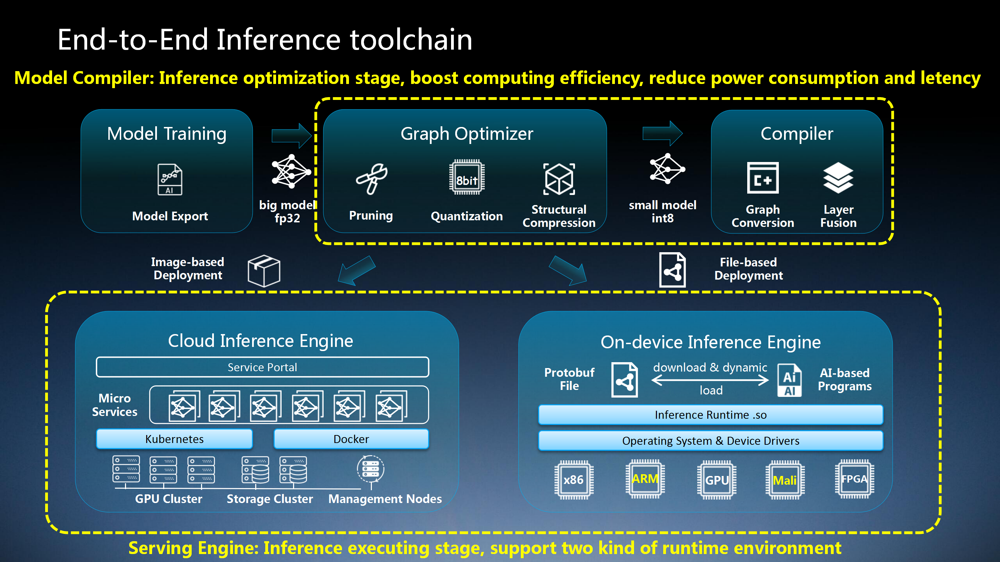
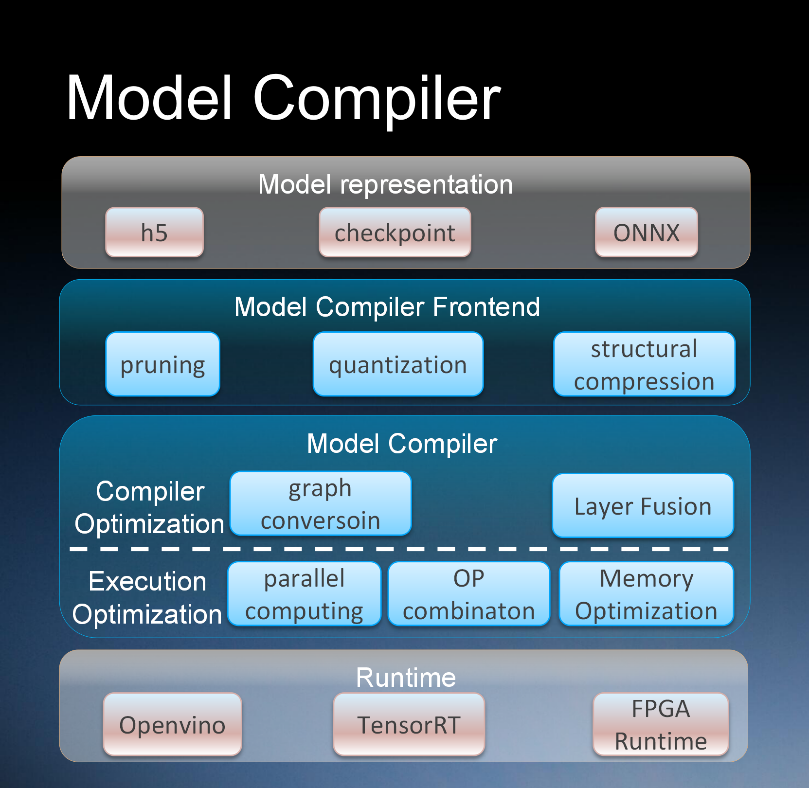
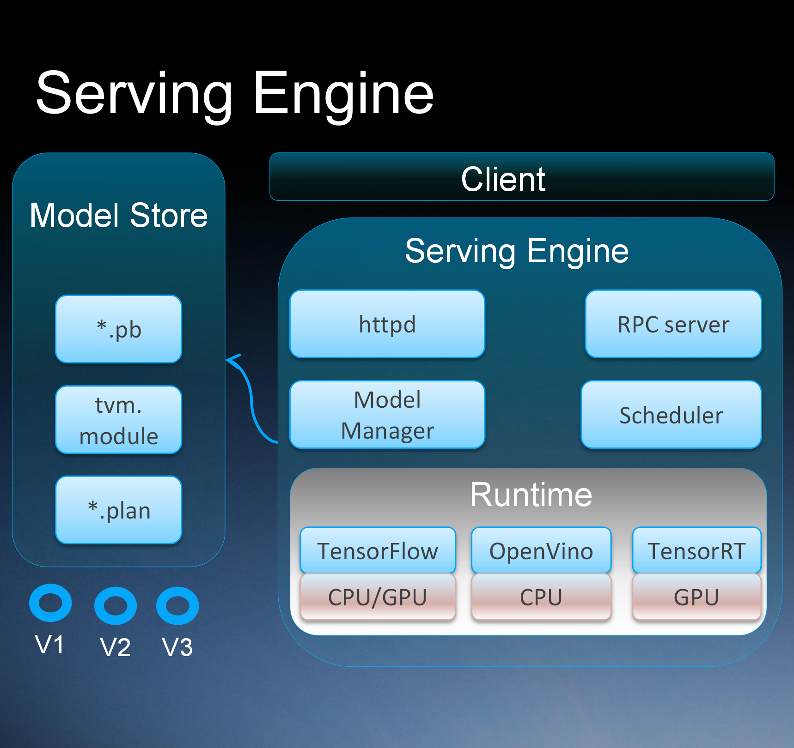

# Adlik

[](https://dev.azure.com/Adlik/GitHub/_build/latest?definitionId=1&branchName=master)
[](https://app.bors.tech/repositories/20625)

***Adlik*** is an end-to-end optimizing framework for deep learning models. The goal of Adlik is to accelerate deep
learning inference process both on cloud and embedded environment.

***Adlik*** consists of two sub projects: Model compiler and Serving platform.

***Model compiler*** supports several optimizing technologies like pruning, quantization and structural compression,
which can be easily used for models developed with TensorFlow, Keras, PyTorch, etc.

***Serving platform*** provides deep learning models with optimized runtime based on the deployment environment. Put
simply, based on a deep learning model, the users of Adlik can optimize it with model compiler and then deploy it to a
certain platform with Adlik serving platform.



With Adlik framework, different deep learning models can be deployed to different platforms with high performance in a
much flexible and easy way.

## Adlik: Model Compiler



1. Support optimization for models from different kinds of deep learning architecture, eg. TensorFlow/Caffe/PyTorch.
2. Support compiling models as different formats, OpenVINO IR/ONNX/TensorRT for different runtime, eg. CPU/GPU/FPGA.
3. Simplified interfaces for the workflow.

## Adlik: Serving Engine



1. Model uploading & upgrading, model inference & monitoring.
2. Unified inference interfaces for different models.
3. Management and scheduling for a solution with multiple models in various runtime.
4. Automatic selection of inference runtime.
5. Ability to add customized runtime.

## Build

This guide is for building Adlik on [Ubuntu](https://ubuntu.com) systems.

First, install [Git](https://git-scm.com/download) and [Bazel](https://docs.bazel.build/install.html).

Then, clone Adlik and change the working directory into the source directory:

```sh
git clone https://github.com/ZTE/Adlik.git
cd Adlik
```

### Build clients

1. Install the following packages:
   - `python3-setuptools`
   - `python3-wheel`
2. Build clients:

   ```sh
   bazel build //adlik_serving/clients/python:build_pip_package -c opt --incompatible_no_support_tools_in_action_inputs=false
   ```

3. Build pip package:

   ```sh
   mkdir /tmp/pip-packages && bazel-bin/adlik_serving/clients/python/build_pip_package /tmp/pip-packages
   ```

### Build serving

First, install the following packages:

- `automake`
- `libtool`
- `make`
- `libtbb2`

#### Build serving with OpenVINO runtime

1. Install `intel-openvino-ie-rt-core` package from
   [OpenVINO](https://docs.openvinotoolkit.org/2019_R3.1/_docs_install_guides_installing_openvino_apt.html).
2. Assume the installation path of OpenVINO is `/opt/intel/openvino_VERSION`, run the following command:

   ```sh
   export INTEL_CVSDK_DIR=/opt/intel/openvino_VERSION
   export InferenceEngine_DIR=$INTEL_CVSDK_DIR/deployment_tools/inference_engine/share
   bazel build //adlik_serving \
       --config=openvino \
       -c opt \
       --incompatible_no_support_tools_in_action_inputs=false \
       --incompatible_disable_nocopts=false
   ```

#### Build serving with TensorFlow CPU runtime

Run the following command:

```sh
bazel build //adlik_serving \
    --config=tensorflow-cpu \
    -c opt \
    --incompatible_no_support_tools_in_action_inputs=false \
    --incompatible_disable_nocopts=false
```

#### Build serving with TensorFlow GPU runtime

Assume builing with CUDA version 10.0.

1. Install the following packages from
   [here](https://docs.nvidia.com/cuda/cuda-installation-guide-linux/index.html#ubuntu-installation) and
   [here](https://docs.nvidia.com/deeplearning/sdk/cudnn-install/index.html#ubuntu-network-installation):

   - `cuda-cublas-dev-10-0`
   - `cuda-cufft-dev-10-0`
   - `cuda-cupti-10-0`
   - `cuda-curand-dev-10-0`
   - `cuda-cusolver-dev-10-0`
   - `cuda-cusparse-dev-10-0`
   - `libcudnn7=*+cuda10.0`
   - `libcudnn7-dev=*+cuda10.0`
2. Run the following command:

   ```sh
   env TF_CUDA_VERSION=10.0 \
       bazel build //adlik_serving \
           --config=tensorflow-gpu \
           -c opt \
           --incompatible_no_support_tools_in_action_inputs=false \
           --incompatible_disable_nocopts=false \
           --incompatible_use_specific_tool_files=false
   ```

#### Build serving with TensorRT runtime

Assume building with CUDA version 10.0.

1. Install the following packages from
   [here](https://docs.nvidia.com/cuda/cuda-installation-guide-linux/index.html#ubuntu-installation) and
   [here](https://docs.nvidia.com/deeplearning/sdk/cudnn-install/index.html#ubuntu-network-installation):

   - `cuda-cublas-10-0`
   - `cuda-cufft-10-0`
   - `cuda-cupti-10-0`
   - `cuda-curand-10-0`
   - `cuda-cusolver-10-0`
   - `cuda-cusparse-10-0`
   - `cuda-nvml-dev-10-0`
   - `cuda-nvrtc-10-0`
   - `libcudnn7=*+cuda10.0`
   - `libcudnn7-dev=*+cuda10.0`
   - `libnvinfer7=*+cuda10.0`
   - `libnvinfer-dev=*+cuda10.0`
   - `libnvonnxparsers7=*+cuda10.0`
   - `libnvonnxparsers-dev=*+cuda10.0`
2. Run the following command:

   ```sh
    env TF_CUDA_VERSION=10.0 \
        bazel build //adlik_serving \
            --config=tensorrt \
            -c opt \
            --action_env=LIBRARY_PATH=/usr/local/cuda-10.0/lib64/stubs \
            --incompatible_no_support_tools_in_action_inputs=false \
            --incompatible_disable_nocopts=false \
            --incompatible_use_specific_tool_files=false
   ```

### Deploy serving service
   
#### OpenVINO service
   ```sh
    source  /opt/intel/openvino_VERSION/bin/setupvars.sh
    cd {dir_of_adlik_serving_binary}
    ./adlik_serving --model_base_path={model_repos_dir} --grpc_port={grpc_port} --http_port={http_port}
   ```  
  
#### TensorFlow CPU/GPU or TensorRT service
   ```sh
    cd {dir_of_adlik_serving_binary}
    ./adlik_serving --model_base_path={model_repos_dir} --grpc_port={grpc_port} --http_port={http_port}
   ```

### Build in Docker

The `ci/docker/build.sh` file can be used to build a Docker images that contains all the requirements for building
Adlik. You can build Adlik with the Docker image.
