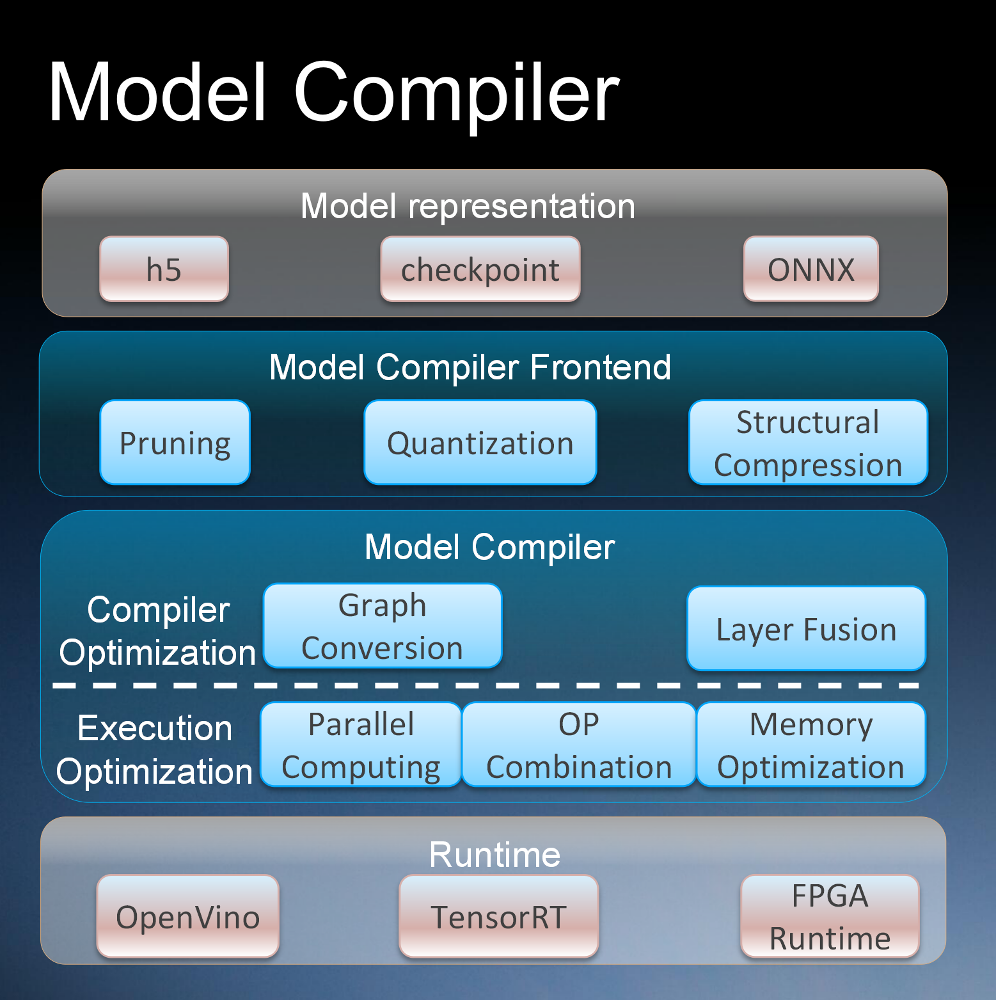

# Adlik

[](https://dev.azure.com/Adlik/GitHub/_build/latest?definitionId=1&branchName=master)
[](https://dev.azure.com/Adlik/GitHub/_build/latest?definitionId=1&branchName=master)
[](https://dev.azure.com/Adlik/GitHub/_build/latest?definitionId=1&branchName=master)
[](https://app.bors.tech/repositories/20625)

***Adlik*** is an end-to-end optimizing framework for deep learning models. The goal of Adlik is to accelerate deep
learning inference process both on cloud and embedded environment.

***Adlik*** consists of two sub projects: Model compiler and Serving platform.

***Model compiler*** supports several optimizing technologies like pruning, quantization and structural compression,
which can be easily used for models developed with TensorFlow, Keras, PyTorch, etc.

***Serving platform*** provides deep learning models with optimized runtime based on the deployment environment. Put
simply, based on a deep learning model, the users of Adlik can optimize it with model compiler and then deploy it to a
certain platform with Adlik serving platform.


With Adlik framework, different deep learning models can be deployed to different platforms with high performance in a
much flexible and easy way.

## Adlik: Model Compiler



1. Support optimization for models from different kinds of deep learning architecture, eg. TensorFlow/Caffe/PyTorch.
2. Support compiling models as different formats, OpenVINO IR/ONNX/TensorRT for different runtime, eg. CPU/GPU/FPGA.
3. Simplified interfaces for the workflow.

## Adlik: Serving Engine


1. Model uploading & upgrading, model inference & monitoring.
2. Unified inference interfaces for different models.
3. Management and scheduling for a solution with multiple models in various runtime.
4. Automatic selection of inference runtime.
5. Ability to add customized runtime.

## Build

This guide is for building Adlik on [Ubuntu](https://ubuntu.com) systems.

First, install [Git](https://git-scm.com/download) and [Bazel](https://docs.bazel.build/install.html).

Then, clone Adlik and change the working directory into the source directory:

```sh
git clone https://github.com/ZTE/Adlik.git
cd Adlik
```

### Build clients

1. Install the following packages:
   - `python3-setuptools`
   - `python3-wheel`
2. Build clients:

   ```sh
   bazel build //adlik_serving/clients/python:build_pip_package -c opt
   ```

3. Build pip package:

   ```sh
   mkdir /tmp/pip-packages && bazel-bin/adlik_serving/clients/python/build_pip_package /tmp/pip-packages
   ```

### Build serving

First, install the following packages:

- `automake`
- `libtbb2`
- `libtool`
- `make`
- `python3-six`

#### Build serving with OpenVINO runtime

1. Install `intel-openvino-runtime-ubuntu<OS_VERSION>-<VERSION>` package from
   [OpenVINO](https://docs.openvinotoolkit.org/2019_R3.1/_docs_install_guides_installing_openvino_apt.html).
2. Assume the installation path of OpenVINO is `/opt/intel/openvino_VERSION`, run the following command:

   ```sh
   export INTEL_CVSDK_DIR=/opt/intel/openvino_VERSION
   export InferenceEngine_DIR=$INTEL_CVSDK_DIR/deployment_tools/inference_engine/share
   bazel build //adlik_serving \
       --config=openvino \
       -c opt
   ```

#### Build serving with TensorFlow CPU runtime

Run the following command:

```sh
bazel build //adlik_serving \
    --config=tensorflow-cpu \
    -c opt
```

#### Build serving with TensorFlow GPU runtime

Assume builing with CUDA version 10.0.

1. Install the following packages from
   [here](https://docs.nvidia.com/cuda/cuda-installation-guide-linux/index.html#ubuntu-installation) and
   [here](https://docs.nvidia.com/deeplearning/sdk/cudnn-install/index.html#ubuntu-network-installation):

   - `cuda-cublas-dev-10-0`
   - `cuda-cufft-dev-10-0`
   - `cuda-cupti-10-0`
   - `cuda-curand-dev-10-0`
   - `cuda-cusolver-dev-10-0`
   - `cuda-cusparse-dev-10-0`
   - `libcudnn7=*+cuda10.0`
   - `libcudnn7-dev=*+cuda10.0`
2. Run the following command:

   ```sh
   env TF_CUDA_VERSION=10.0 \
       bazel build //adlik_serving \
           --config=tensorflow-gpu \
           -c opt \
           --incompatible_use_specific_tool_files=false
   ```

#### Build serving with TensorFlow Lite CPU runtime

Run the following command:

```sh
bazel build //adlik_serving \
    --config=tensorflow-lite-cpu \
    -c opt
```

#### Build serving with TensorRT runtime

Assume building with CUDA version 10.0.

1. Install the following packages from
   [here](https://docs.nvidia.com/cuda/cuda-installation-guide-linux/index.html#ubuntu-installation) and
   [here](https://docs.nvidia.com/deeplearning/sdk/cudnn-install/index.html#ubuntu-network-installation):

   - `cuda-cublas-10-0`
   - `cuda-cufft-10-0`
   - `cuda-cupti-10-0`
   - `cuda-curand-10-0`
   - `cuda-cusolver-10-0`
   - `cuda-cusparse-10-0`
   - `cuda-nvml-dev-10-0`
   - `cuda-nvrtc-10-0`
   - `libcudnn7=*+cuda10.0`
   - `libcudnn7-dev=*+cuda10.0`
   - `libnvinfer7=*+cuda10.0`
   - `libnvinfer-dev=*+cuda10.0`
   - `libnvonnxparsers7=*+cuda10.0`
   - `libnvonnxparsers-dev=*+cuda10.0`
2. Run the following command:

   ```sh
   env TF_CUDA_VERSION=10.0 \
       bazel build //adlik_serving \
           --config=tensorrt \
           -c opt \
           --action_env=LIBRARY_PATH=/usr/local/cuda-10.0/lib64/stubs \
           --incompatible_use_specific_tool_files=false
   ```

### Deploy serving service

#### OpenVINO service

```sh
source /opt/intel/openvino_VERSION/bin/setupvars.sh
cd {dir_of_adlik_serving_binary}
./adlik_serving --model_base_path={model_repos_dir} --grpc_port={grpc_port} --http_port={http_port}
```

#### TensorFlow CPU/GPU or TensorRT service

```sh
cd {dir_of_adlik_serving_binary}
./adlik_serving --model_base_path={model_repos_dir} --grpc_port={grpc_port} --http_port={http_port}
```

### Build in Docker

The `ci/docker/build.sh` file can be used to build a Docker images that contains all the requirements for building
Adlik. You can build Adlik with the Docker image.

*[NOTE]: If you build the runtime with GPU in a Docker image, you need to add the CUDA environment variables in the
Dockerfile, such as:

```dockerfile
ENV NVIDIA_VISIBLE_DEVICES all
ENV NVIDIA_DRIVER_CAPABILITIES compute, utility
```

## Inference performance of serving engine

In order to evaluate the performance of the service engine, we performed inference tests on the same cpu or gpu using
the simple cnn model (mnist model) and the resnet50 model with different runtimes. The cpu and gpu parameters used in
the test are as follows:

|     |                   type                    | number |
| --- | :---------------------------------------: | :----: |
| CPU | Intel(R) Xeon(R) CPU E5-2680 v4 @ 2.40GHz |   1    |
| GPU |           Tesla V100 SXM2 32GB            |   1    |

### The test result of the mnist model

|                      | speed of client (pictures/sec) | speed of serving engine (pictures/sec) | tail latency of one picture (sec) |
| -------------------- | :----------------------------: | :------------------------------------: | :-------------------------------: |
| keras-tf1.14         |            2200.372            |                2291.584                |             1.81E-05              |
| keras-tf2.1          |            2003.901            |                2077.644                |             1.77E-05              |
| keras-OpenVINO       |            2647.344            |                2788.087                |             1.90E-05              |
| keras-TensorRT       |           37342.687            |               163058.592               |             2.06E-05              |
| keras-tfGPU1.14      |           19414.208            |               52247.525                |             3.24E-05              |
| keras-tfGPU2.1       |           19395.129            |               53640.456                |             3.29E-05              |
| keras-TFLiteCPU      |            778.890             |                790.150                 |             1.82E-05              |
| tensorflow-tf1.14    |            1486.878            |                1531.337                |             1.95E-05              |
| tensorflow-tf2.1     |            2160.331            |                2248.311                |             1.81E-05              |
| tensorflow-tfGPU1.14 |           19043.582            |               51448.587                |             3.31E-05              |
| tensorflow-tfGPU2.1  |           19244.343            |               50705.164                |             3.22E-05              |
| tensorflow-TFLiteCPU |            3114.246            |                3250.399                |             1.34E-05              |
| pytorch-OpenVINO     |            9053.677            |               10226.869                |             1.27E-05              |
| pytorch-TensorRT     |           46318.234            |               249302.706               |             1.76E-05              |

*[Note 1]: In the first column of the table, words before '-' represent different runtimes, and words after '-'
represent different inference engines.

*[Note 2]: The tf and OpenVINO serving engine are test in the CPU environment, and the TensorRT and tfGPU serving engine
are test in the GPU environment.

*[Note 3]: The test model of TensorFlow Lite is an unquantified model, and the number of threads is set to 1 during
testing.

### The test result of the resnet50 model

|                      | speed of client (pictures/sec) | speed of serving engine (pictures/sec) | tail latency of one picture (sec) |
| -------------------- | :----------------------------: | :------------------------------------: | :-------------------------------: |
| keras-tf1.14         |             3.599              |                 3.640                  |              0.00311              |
| keras-tf2.1          |             6.183              |                 6.301                  |              0.00302              |
| keras-OpenVINO       |             9.359              |                 9.642                  |              0.00313              |
| keras-TensorRT       |            237.176             |                1402.338                |              0.00350              |
| keras-tfGPU1.14      |            175.423             |                433.627                 |              0.00339              |
| keras-tfGPU2.1       |            170.680             |                420.814                 |              0.00348              |
| keras-TFLiteCPU      |             2.838              |                 2.862                  |              0.00298              |
| tensorflow-tf1.14    |             3.669              |                 3.711                  |              0.00305              |
| tensorflow-tf2.1     |             6.554              |                 6.684                  |              0.00298              |
| tensorflow-tfGPU1.14 |            181.118             |                454.013                 |              0.00331              |
| tensorflow-tfGPU2.1  |            176.710             |                473.091                 |              0.00354              |
| tensorflow-TFLiteCPU |             2.870              |                 2.895                  |              0.00296              |
| pytorch-OpenVINO     |             9.274              |                 9.552                  |              0.00313              |
| pytorch-TensorRT     |            238.244             |                1332.449                |              0.00344              |

## Release

The version of the service engine adlik supports.

|            | TensorFlow 1.14 | TensorFlow 2.1 | Openvino 2019 | Tensorrt 6 | Tensorrt 7 |
| ---------- | :-------------: | :------------: | :-----------: | :--------: | :--------: |
| keras      |        ✓        |       ✓        |       ✓       |     ✓      |     ✓      |
| TensorFlow |        ✓        |       ✓        |       ✓       |     ✓      |     ✓      |
| PyTorch    |        ✗        |       ✗        |       ✓       |     ✓      |     ✗      |
