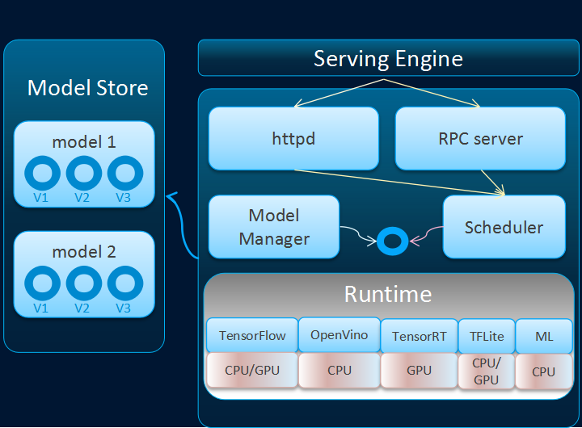

# Adlik: Serving Engine

1. Model upload, upgrade, versioning, inference and monitoring.
2. Unified inference interfaces for different runtimes.
3. Unified management and scheduling of multi-runtime, multi-model and multi-instance.
4. Automatic selection of inference runtime.
5. Supporting customized runtime and ML runtime.

## Usage

**First**, Confirm that the environment where adlik is installed is the Ubuntu operating system. If you do not have the
ubuntu system on your environment, but you still want to use Adlik, you can install the Adlik in
[docker](https://www.docker.com/). And in this way, you need to configure available mirror source (for example:
[Tsinghua Open Source Mirror](https://mirrors.tuna.tsinghua.edu.cn/)) for your docker and pull an ubuntu docker images.

**Second**, use [Git](https://git-scm.com/download) clone the Adlik code or download zip.

**Third**, follow the [build step](../README.md#build) to build the Adlik.
