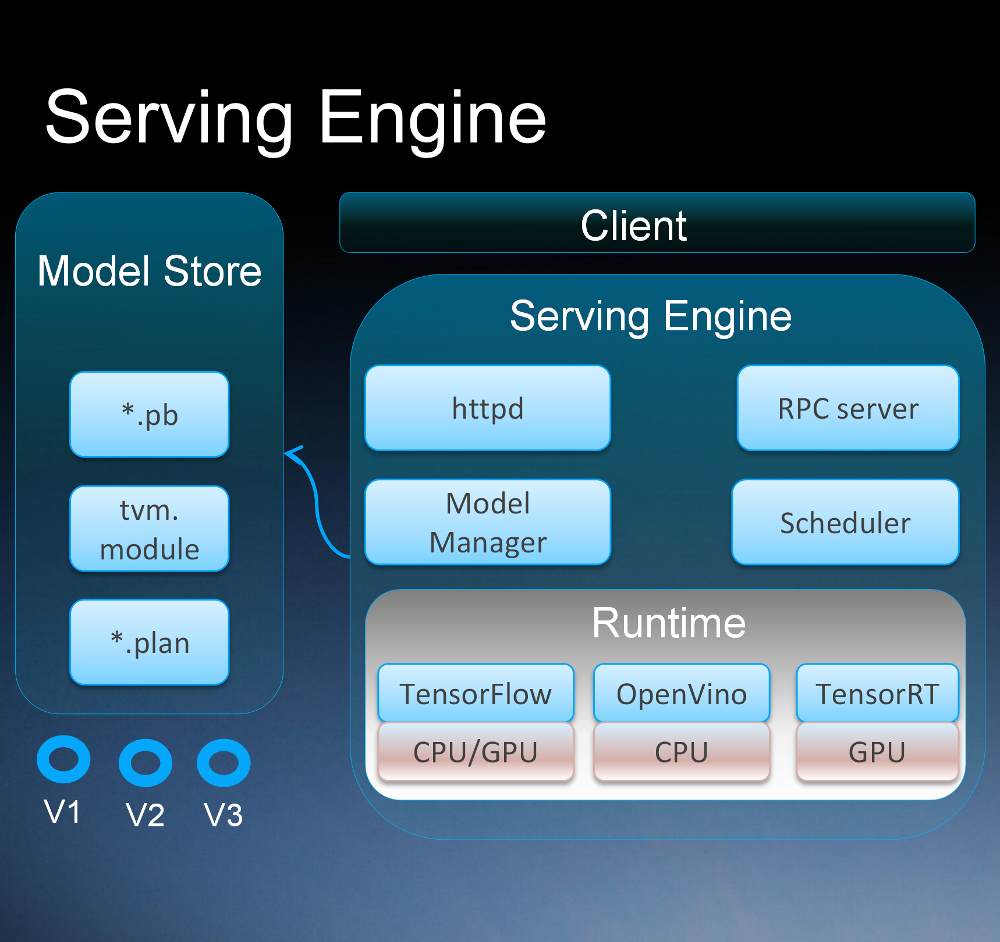

# Adlik: Serving Engine

1. Model uploading & upgrading, model inference & monitoring.
2. Unified inference interfaces for different models.
3. Management and scheduling for a solution with multiple models in various runtime.
4. Automatic selection of inference runtime.
5. Ability to add customized runtime.

## Usage

**First**, Confirm that the environment where adlik is installed is the Ubuntu operating system. If you do not have the
ubuntu system on your environment, but you still want to use Adlik, you can install the Adlik in
[docker](https://www.docker.com/). And in this way, you need to configure available mirror source (for example:
[Tsinghua Open Source Mirror](https://mirrors.tuna.tsinghua.edu.cn/)) for your docker and pull an ubuntu docker images.

**Second**, use [Git](https://git-scm.com/download) clone the Adlik code or download zip.

**Thrid**, follw the [build step](../README.md#build) build the Adlik.
