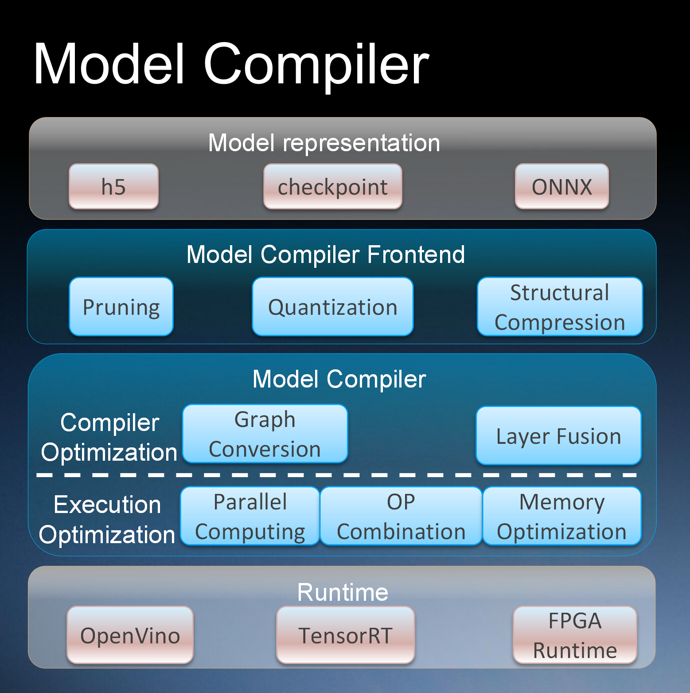

# Adlik: Model Compiler



1. Support optimization for models from different kinds of deep learning architecture, eg. TensorFlow/Caffe/PyTorch.
2. Support compiling models as different formats, OpenVINO IR/ONNX/TensorRT, TensorFlow Lite for different runtime,
eg. CPU/GPU/FPGA.
3. Simplified interfaces for the workflow.

## Usage

1. Create a compilation environment based on the compilation type.

2. Get the model file in the specified format, such as `H5`, `Checkpoint`, `Frozen Graph`, `ONNX`.

3. Create a json file which must match [config_schema.json](../model_compiler/src/model_compiler/config_schema.json).

4. Install model_compiler and compile the model, you can refer to [this](../benchmark/src/compile_model.py) or
[this](../examples/keras_model/compile_model.py):

```sh
cd {Adlik_root_dir}/model_compiler
pip3 install .
```
